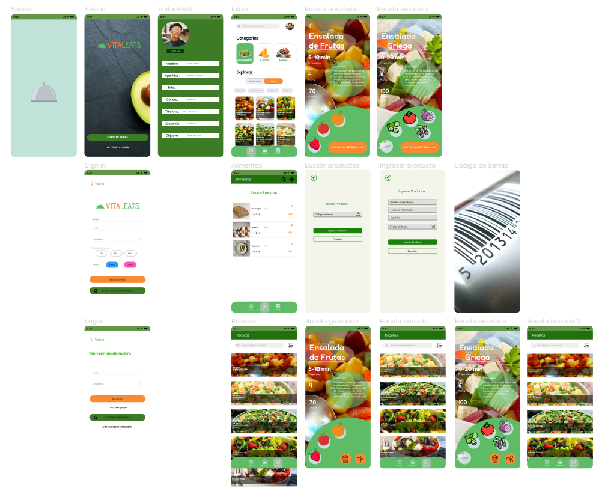
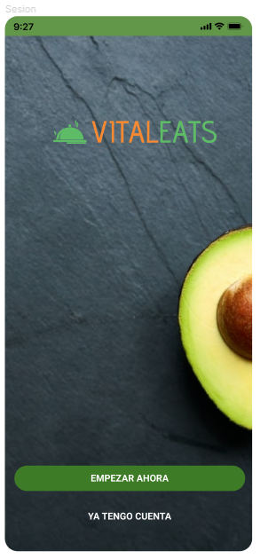
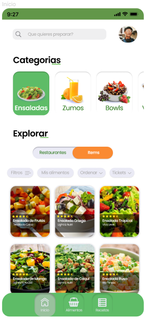
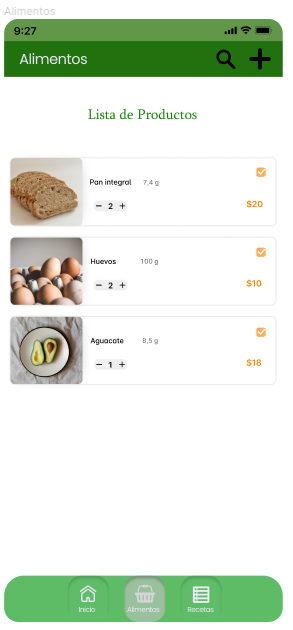
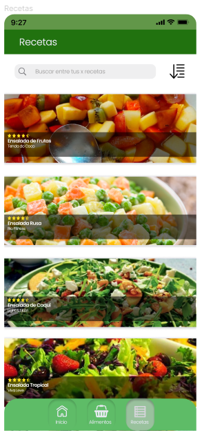
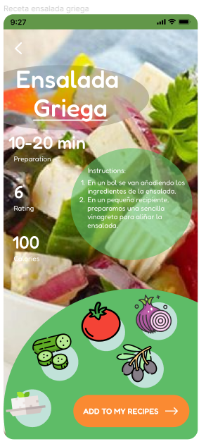

# VitalEats
Application that allows you to find food recipes. This project will be made by Jacobo Sánchez, David Novo and Alejandro Bravo for the modules: "Desarrollo de Interfaces" and "Programación Multimedia y dispositivos Móviles"

## [Figma prototype](https://www.figma.com/file/wGVM2AKIX5Oo8FFfbxI8UX/VitalEats?node-id=149%3A4&t=WGamqrIxcl1UuumH-0)

## User manual

#### Welcome to MeetMap, an application that will allow you to meet a lot of people doing really interesting plans in Madrid.

##### The application is simple to use, it allows you to add your own foods and search for recipes according to what you have in your pantry. You can create an account and it will be saved in case you want to log in with it from another device.

When the application is opened we will see a screen in which the food categories will be shown, allowing us to explore recipes from other users.

We can change the page with the navigation bar and go to food where we will have our food saved and we can also enter new ones by reading the code.

The next function would be recipes, where all the recipes that we have saved are, being able to enter them seeing their specifications

